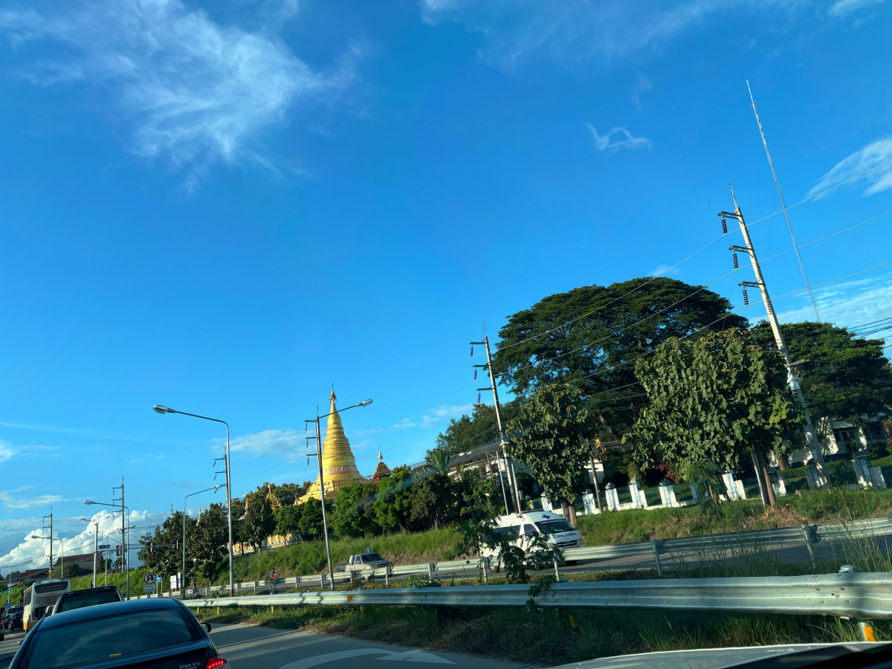
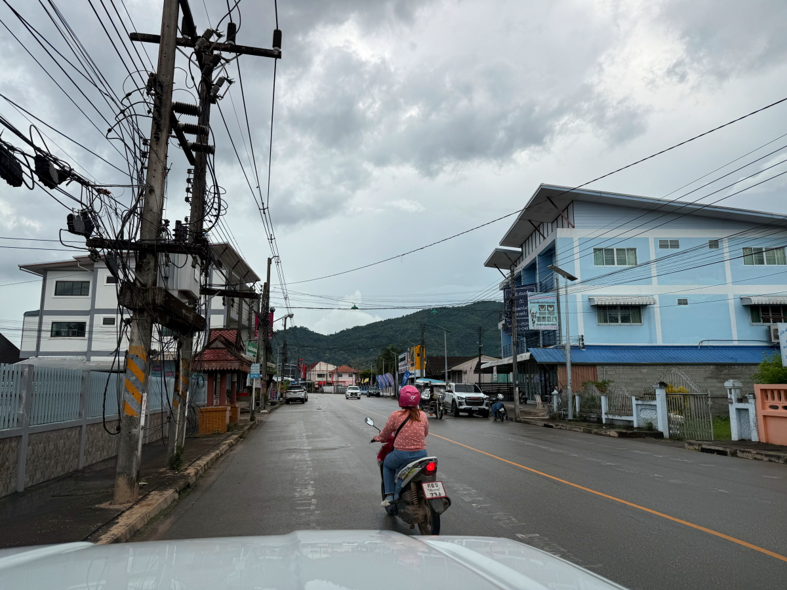
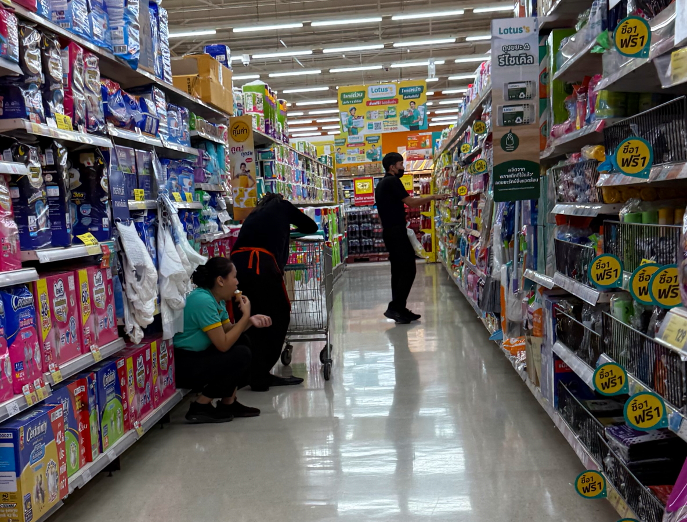
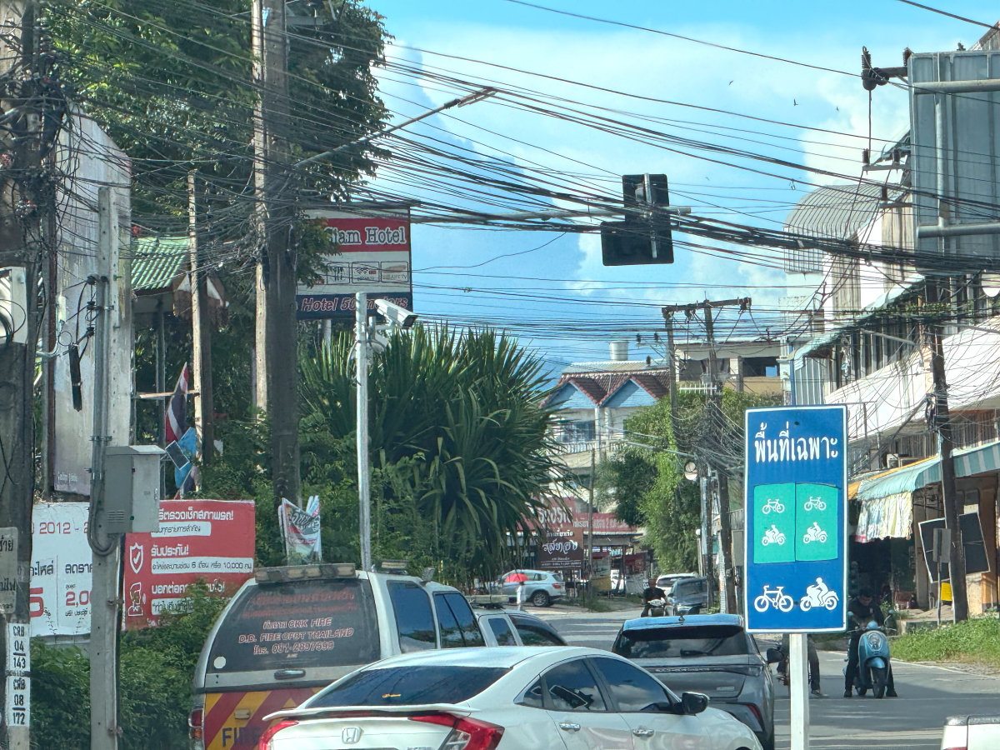
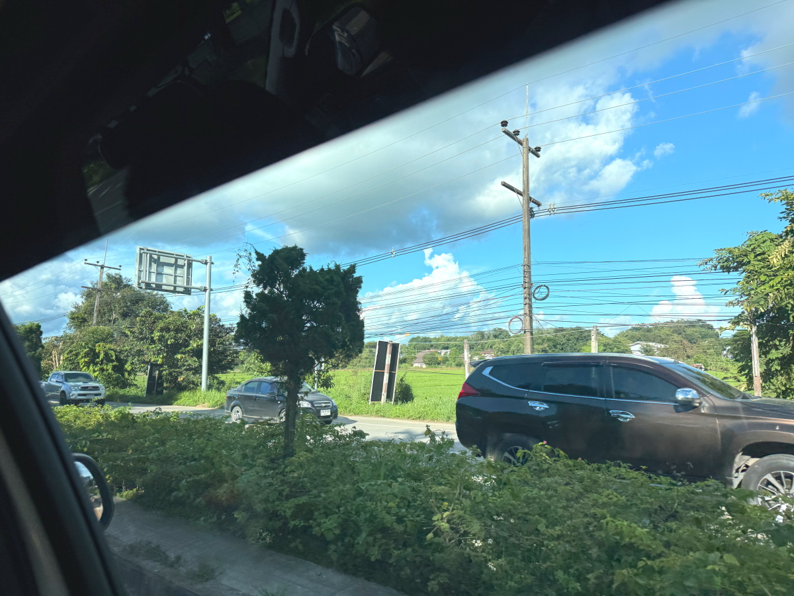

# 20250924_maechan

<html lang="ja" data-loaded="false" data-scrolled="false" data-spmenu="closed">
<head>

<meta charset="UTF-8">
<meta http-equiv="Content-Type" content="text/html; charset=UTF-8">
<meta http-equiv="X-UA-Compatible" content="IE=EmulateIE10" />
<meta http-equiv="X-UA-Compatible" content="IE=edge">

<meta name="viewport" content="width=device-width, initial-scale=1.0">

<!--ここから上はお決まりの定型文です-->

<!--ここからが表現の書式などを決めるcssという部分-->

<link href="https://cdnjs.cloudflare.com/ajax/libs/lightbox2/2.7.1/css/lightbox.css" rel="stylesheet">

</head>

<body>

モバイル端末をお使いの場合は、画面を横向きにすると
背景画像の横方向がご覧頂けます。

<!--ここ上は、ほぼそのまま使います！-->

<!--QRコードの挿入例-->

 アクセス用QRコード

<marquee direction="left" scrollamount="20" width="30%">(^_^)/~alis</marquee>

<!--流れ文字の挿入例-->
<h1><marquee behavior="left">!!! 2025/09/21-23、チェンライへの移動から、メーちゃんの街まで!!!</marquee></h1>

                          

<!--ここから下が、本体部分-->
    

 
<h2>21日、チェンライ移動の道、広大な大陸にまっすぐな道を通しています</h2>

    
<h2>タイにはトンネルは無くて、山の低いところを直線道路で越えます</h2>

    
<h2>お寺が出来ると、周辺に人が集まって街になります</h2>

    
<h2>街のエリアに入ったことを示す、道を跨ぐモニュメント</h2>

    
<h2>入道雲の下はスコール</h2>

    
<h2>大仏様はライトアップされています</h2>

    
<h2>夜にはメーチャンに到着、猫ちゃん達がお出迎え</h2>

    
<h2>ニワトリも元気</h2>

    
<h2>アヒルの一家も元気</h2>

    
<h2>22日、朝から入道雲が湧き上がります、雨季ですね〜</h2>

    
<h2>義妹のお店でお昼ご飯</h2>

    
<h2>メーちゃん街でBangKok Bankに寄ります</h2>

    
<h2>向かい側は携帯のお店</h2>

    
<h2>Lotus`sにも寄ります</h2>

    
<h2>店員さんは通路でアイス、超田舎です</h2>

    
<h2>スイカは半分で28バーツ ≒ 100円強</h2>

    
<h2>学校帰りの高校生たち</h2>

    
<h2>セブンイレブンの前では、配達員たちが互いのバイクを比較してました</h2>

    
<h2>こちらにも学校帰りの学生さんたち</h2>

    
<h2>5歳の甥っ子は超元気！</h2>

    
<h2>夕方まで天気は持ちました</h2>

    
<h2>義弟とタイのビール瓶</h2>

    
<h2>半屋外の台所には扇風機が大量にあります</h2>

    
<h2>23日、庭先のお花たち</h2>

    
<h2>バイクを停めてスマホをいじるのはかなりまともな方</h2>

    
<h2>県境の山々</h2>

    
<h2>大学のそばでは、学生さんたちのバイクが沢山</h2>

    
<h2>チェンライの入管でVISAの延長手続き</h2>

    
<h2>顔写真が足りなくて、BigCameraで撮影してプリント</h2>

    
<h2>ついでにそばの電気屋さんでPCを物色、グラボのスペック落ちで日本よりちょっと安めか同じくらい</h2>

    
<h2>入管は大混雑</h2>

    
<h2>VISAが延長できたので、ちょっと遅いお昼ごはん</h2>

    
<h2>横のお花屋さんのケイトウが綺麗</h2>

    
<h2>チェンライの街を北上してメーチャンに帰ります</h2>

    
<h2>中央分離帯の象さんのお着物と野鳥の鳩</h2>

    
<h2>北に湧き上がる入道雲</h2>

    
<h2>トラックの荷台でくつろぐタイ人たち</h2>

<iframe width="560" height="315" src="https://www.youtube.com/embed/ZKwwH6TEtRc?si=XTmCHTApS15A8Ibi" title="YouTube video player" frameborder="0" allow="accelerometer; autoplay; clipboard-write; encrypted-media; gyroscope; picture-in-picture; web-share" referrerpolicy="strict-origin-when-cross-origin" allowfullscreen></iframe>
    

    
<h2>密入国者の取締り検問</h2>

<iframe width="560" height="315" src="https://www.youtube.com/embed/Pm7rxvxb88k?si=HKogzMlPJNkrq5Rd" title="YouTube video player" frameborder="0" allow="accelerometer; autoplay; clipboard-write; encrypted-media; gyroscope; picture-in-picture; web-share" referrerpolicy="strict-origin-when-cross-origin" allowfullscreen></iframe>
    

    
<h2>最後は夕陽を浴びた黄色いお花</h2>

         

<!--  
<h2>再掲【暑中お見舞い（ほたる）】LINEでご挨拶・動画で送る夏のグリーティングカード / ギターbgm/蛍の光・癒し動画</h2>

<iframe width="560" height="315" src="https://www.youtube.com/embed/Z4PKDOhRzfI?si=LaAJ8dA-1izGspEO" title="YouTube video player" frameborder="0" allow="accelerometer; autoplay; clipboard-write; encrypted-media; gyroscope; picture-in-picture; web-share" referrerpolicy="strict-origin-when-cross-origin" allowfullscreen></iframe>
    
   
-->   
    
    

  
<h2>今日のBGMは Lionel Richie, Elton John, Bee Gees, Journey, Billy Joel 📀 Soft Rock Ballads 70s 80s 90s</h2>

<iframe width="560" height="315" src="https://www.youtube.com/embed/6RG-ALb8FA0?si=LmU_H1wwrD7UX4b9" title="YouTube video player" frameborder="0" allow="accelerometer; autoplay; clipboard-write; encrypted-media; gyroscope; picture-in-picture; web-share" referrerpolicy="strict-origin-when-cross-origin" allowfullscreen></iframe>
    

    
  
<h2>8月17日にメタバースで披露されたまいてゃさんの新曲「Lonely game」</h2>

<iframe width="560" height="315" src="https://www.youtube.com/embed/HstFJ2_8oQA?si=QrYNv_EcIm7fALkV" title="YouTube video player" frameborder="0" allow="accelerometer; autoplay; clipboard-write; encrypted-media; gyroscope; picture-in-picture; web-share" referrerpolicy="strict-origin-when-cross-origin" allowfullscreen></iframe>
    

    
    

    
    
    <h3>「雪の中で輝くシンデレラ」by まいてゃ</h3>
<h2><a href="https://torokoid.github.io/20250219_chiangrai/maitiyaz.mp3" target="_blank">この文字クリックで再生します 下の再生ボタンでも同じ曲をループ再生します</a></h2>

    <audio controls loop>
        <source src="https://torokoid.github.io/20250219_chiangrai/maitiyaz.mp3" type="audio/mpeg">
        お使いのブラウザは audio タグをサポートしていません。
    </audio>
 
    
<!--
  
<h2>スティーブ・ジョブズの伝説の講義</h2> 
<iframe width="560" height="315" src="https://www.youtube.com/embed/XsRpvWHIVw0?si=f7IA0pv9iZWVk3VH" title="YouTube video player" frameborder="0" allow="accelerometer; autoplay; clipboard-write; encrypted-media; gyroscope; picture-in-picture; web-share" referrerpolicy="strict-origin-when-cross-origin" allowfullscreen></iframe>    
    
    
<h2>スティーブ・ジョブズ氏の講義の内容が「笑って死ぬ」by まいてゃ さんの歌の内容と大筋で同じに聞こえます 以下に再掲しますね</h2>

    
<h3>歌の後半部分しか撮れてませんが、2月16日のイベントで公開された「笑って死ぬ」 by まいてゃ 白ドレスはダンサーの玖遠さん、黒いドレスがまいてゃさん</h3>
<iframe width="560" height="315" src="https://www.youtube.com/embed/s4ZcbxAluMM?si=Xa32xo19UCNaWv0v" title="YouTube video player" frameborder="0" allow="accelerometer; autoplay; clipboard-write; encrypted-media; gyroscope; picture-in-picture; web-share" referrerpolicy="strict-origin-when-cross-origin" allowfullscreen></iframe> 
-->
    

    <h3>お気に入りの「笑って死ぬ」 by まいてゃさんも再々掲です</h3>
<h2><a href="https://torokoid.github.io/20250221_chiangrai/maitiya3.mp3" target="_blank">この文字クリックで再生します 下の再生ボタンで同じ曲をループ再生します</a></h2>

    <audio controls loop>
        <source src="https://torokoid.github.io/20250221_chiangrai/maitiya3.mp3" type="audio/mpeg">
        お使いのブラウザは audio タグをサポートしていません。
    </audio>

   
<h2>以上、チェンライへの移動から、メーちゃんの街まででした。 ここまでご覧いただきありがとうございました。</h2>

     
<h2>
<a href="https://torokoid.github.io/Mashiko_himawari_3/" target="_blank">クリックでメニューページに戻ります</a>
</h2>

   

<!-- hitwebcounter Code START -->
<a href="https://www.hitwebcounter.com" target="_blank">

あなたは 番目の訪問者です 数値は8月1日以降に立ち上げたバンコク・パタヤ・メーチャンシリーズHPの累計です
</a>   

         

  

      

<!--本体はここまで-->

<!--画面に空白地帯を作って、背景が見えるようにしています-->
                                              

<!-- フッタ -->
<footer>

Copyright 2025/09/24 alis @Mae Chan

</footer>

<!--HPにさまざまなJavaScriptを呼び込むための書式-->

    
    </body>
    
</html>
